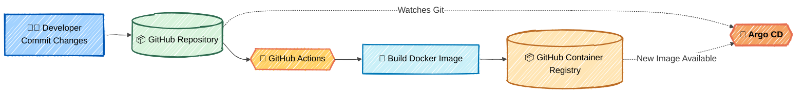
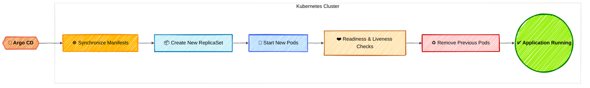

# 🚀 Argo CD Go GitOps Demo

This repository demonstrates a complete GitOps workflow using Argo CD, Kubernetes, and a containerized Go application.

The project showcases how to manage Kubernetes deployments declaratively with Git as the single source of truth. Changes committed to the repository are automatically synchronized to the cluster by Argo CD, enabling reproducible, auditable, and automated application delivery.

---

## 🏗️ GitOps Workflow

The following diagrams illustrate the GitOps deployment flow implemented by this project.

### Part 1 - Continuous Integration (CI)



### Part 2 - Continuous Deployment (CD)



---

## 📦 What is included

- `app/`: Go HTTP service with `/` and `/healthz`
- `Dockerfile`: Multi-stage container build
- `manifests/`: Kubernetes namespace, deployment, service, and Kustomize configuration
- `argocd-apps/`: Argo CD `Application` manifest
- `.github/workflows/`: GitHub Actions workflow to build and publish the application image
- `scripts/`: Helper scripts for building and deployment

---

## 📋 Prerequisites

For local deployment on Docker Desktop Kubernetes, install:

- Docker Desktop with Kubernetes enabled
- `kubectl`
- Go (only if you want to run the application locally)
- A GitHub account (or another Git provider) accessible by Argo CD

Verify that Docker Desktop Kubernetes is your active context:

```bash
kubectl config current-context
kubectl get nodes
```

If needed:

```bash
kubectl config use-context docker-desktop
```

---

## ▶️ Run the Go application locally

```bash
go run ./app

curl http://localhost:8080/
curl http://localhost:8080/healthz
```

---

## 🐳 Build and publish the container image

The application image must be available in a container registry before Kubernetes can deploy it.

Update the image name in:

- `manifests/deployment.yaml`
- `scripts/build-and-push.sh`

Example using GitHub Container Registry:

```bash
IMAGE=ghcr.io/<your-org>/argocd-go-gitops:latest ./scripts/build-and-push.sh
```

Update your deployment:

```yaml
image: ghcr.io/<your-org>/argocd-go-gitops:latest
```

Commit and push your repository:

```bash
git add .
git commit -m "Initial commit"
git push
```

---

## ☸️ Install Argo CD on Docker Desktop Kubernetes

Create the namespace:

```bash
kubectl create namespace argocd
```

Install Argo CD:

```bash
kubectl apply -n argocd \
-f https://raw.githubusercontent.com/argoproj/argo-cd/stable/manifests/install.yaml
```

Wait until all components are ready:

```bash
kubectl wait --for=condition=available deployment/argocd-server -n argocd --timeout=300s
kubectl wait --for=condition=available deployment/argocd-repo-server -n argocd --timeout=300s
kubectl wait --for=condition=available deployment/argocd-redis -n argocd --timeout=300s
```

Verify:

```bash
kubectl get pods -n argocd
```

---

## 🌐 Access the Argo CD UI

Start a local port-forward:

```bash
kubectl port-forward svc/argocd-server -n argocd 8080:443
```

Open:

```
https://localhost:8080
```

Retrieve the admin password:

```bash
kubectl -n argocd get secret argocd-initial-admin-secret \
-o jsonpath="{.data.password}" | base64 -d
```

Login:

```
Username: admin
Password: <retrieved password>
```

---

## ⚙️ Configure the Argo CD Application

Update the repository URL inside:

```
argocd-apps/go-demo-application.yaml
```

Example:

```yaml
repoURL: https://github.com/openmind-systems-lab/argocd-go-gitops.git
```

Deploy the application:

```bash
kubectl apply -f argocd-apps/go-demo-application.yaml
```

Verify:

```bash
kubectl -n argocd get applications
kubectl -n go-demo get pods
kubectl -n go-demo get svc
```

---

## ✅ Test the deployed application

Forward the service:

```bash
kubectl -n go-demo port-forward svc/go-demo 8081:80
```

Open:

```
http://localhost:8081
```

Or test using curl:

```bash
curl http://localhost:8081/
curl http://localhost:8081/healthz
```

---

## 💻 Optional: Install the Argo CD CLI

### macOS

```bash
brew install argocd
```

### Windows

```powershell
choco install argocd-cli
```

### Linux

```bash
curl -sSL -o argocd https://github.com/argoproj/argo-cd/releases/latest/download/argocd-linux-amd64

sudo install -m 555 argocd /usr/local/bin/

rm argocd
```

Login:

```bash
argocd login localhost:8080 --username admin --password <PASSWORD> --insecure

argocd app list
```

---

## 🛠️ Troubleshooting

### 🚫 Argo CD resources cannot be created

Verify the CRDs are installed:

```bash
kubectl get crd | grep argoproj
```

---

### 🔐 Argo CD cannot access the Git repository

Verify:

- Repository URL
- Repository visibility
- Git credentials (for private repositories)

---

### 📥 Kubernetes cannot pull the container image

Verify:

- Image exists in the registry
- Image tag is correct
- Image is public or `imagePullSecrets` are configured

Inspect pod events:

```bash
kubectl describe pod <pod-name> -n go-demo
```

---

### ⚠️ Port 8080 is already in use

Use another local port:

```bash
kubectl port-forward svc/argocd-server -n argocd 9090:443
```

---


## 🚀 Argo CD Go GitOps Demo

<details>
<summary>🎥 Watch the demo</summary>

https://github.com/user-attachments/assets/ac014604-9ba0-4e56-b2e9-ac6080e7f2ca

</details>

---

## 🧹 Clean up

Remove the demo application:

```bash
kubectl delete -f argocd-apps/go-demo-application.yaml

kubectl delete namespace go-demo
```

Remove Argo CD:

```bash
kubectl delete namespace argocd
```

---

## 🔧 Configuration Checklist

Before deploying, update the following placeholders:

- `<your-org>`
- GitHub repository URL
- Container image
- Image tag
- GitHub Container Registry namespace
