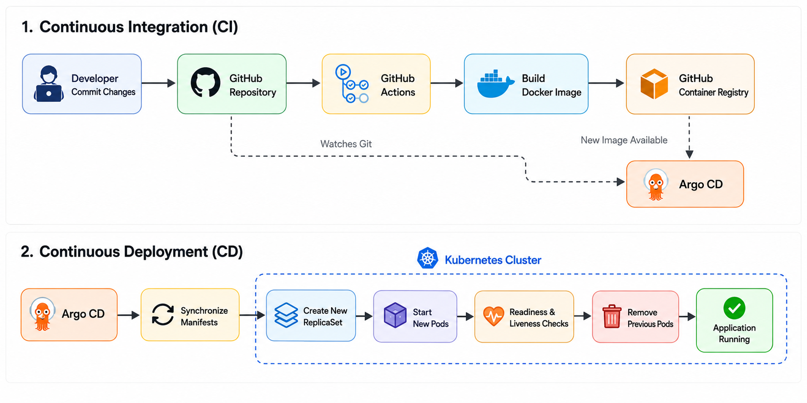

<p align="center">
  
</p>

<h1 align="center">Argo CD GitOps Playground</h1>

<p align="center">
An Open Source Proof of Concept demonstrating GitOps application delivery using Argo CD and Kubernetes.
</p>

<p align="center">


</p>

---

# 📖 Overview

This Proof of Concept demonstrates how **Argo CD** continuously synchronizes Kubernetes resources from a Git repository.

The repository acts as the **single source of truth**, allowing Kubernetes applications to be deployed declaratively using GitOps principles.

---

# 🏗️ Architecture

<p align="center">
  
</p>

---

# 🎯 Objective

This Proof of Concept demonstrates how to:

- Install Argo CD on Kubernetes.
- Deploy an application using GitOps.
- Synchronize Kubernetes manifests directly from Git.
- Automatically reconcile configuration drift.
- Observe application status through the Argo CD UI.

---

# ⚙️ Prerequisites

- Docker Desktop (Kubernetes enabled)
- kubectl
- Git repository accessible by Argo CD
- Container image available in a registry

---

# 📦 Install Argo CD

Create the namespace:

```bash
kubectl create namespace argocd
```

Install Argo CD:

```bash
kubectl apply -n argocd \
-f https://raw.githubusercontent.com/argoproj/argo-cd/stable/manifests/install.yaml
```

Wait for the main components:

```bash
kubectl wait --for=condition=available deployment/argocd-server \
-n argocd --timeout=300s

kubectl wait --for=condition=available deployment/argocd-repo-server \
-n argocd --timeout=300s

kubectl wait --for=condition=available deployment/argocd-redis \
-n argocd --timeout=300s
```

---

# 🚀 Deploy the Demo

Update the repository URL inside:

```
argocd-apps/go-demo-application.yaml
```

Example:

```yaml
repoURL: https://github.com/openmind-systems-lab/argocd-go-gitops.git
```

Deploy the Argo CD Application:

```bash
kubectl apply -f argocd-apps/go-demo-application.yaml
```

---

# 🔍 Verification

Verify Argo CD components:

```bash
kubectl get pods -n argocd
```

Verify the application:

```bash
kubectl get applications -n argocd
```

Verify the deployed resources:

```bash
kubectl get pods -n go-demo
kubectl get svc -n go-demo
```

---

# 🧪 Testing

Expose the Argo CD UI:

```bash
kubectl port-forward svc/argocd-server \
-n argocd \
8080:443
```

Retrieve the admin password:

```bash
kubectl -n argocd get secret argocd-initial-admin-secret \
-o jsonpath="{.data.password}" | base64 -d
```

Open:

```
https://localhost:8080
```

Verify the application status is:

```text
Healthy
Synced
```

Expose the demo application:

```bash
kubectl port-forward svc/go-demo \
-n go-demo \
8081:80
```

Test the application:

```bash
curl http://localhost:8081/

curl http://localhost:8081/healthz
```

---

# 📚 What You Will Learn

After completing this Proof of Concept, you will understand how to:

- Install Argo CD.
- Deploy applications using GitOps.
- Manage Kubernetes manifests declaratively.
- Synchronize Kubernetes from Git.
- Detect and reconcile configuration drift.
- Monitor application health through the Argo CD Dashboard.

---

# 🎥 Demo

The following video demonstrates the complete GitOps workflow:

- Install Argo CD
- Deploy the Application resource
- Synchronize Kubernetes resources
- Observe automatic reconciliation
- Verify the deployed application
- Explore the Argo CD Dashboard

<details>
<summary>▶️ Watch the demo</summary>

https://github.com/user-attachments/assets/ac014604-9ba0-4e56-b2e9-ac6080e7f2ca

</details>

---

# 🧹 Cleanup

Delete the demo application:

```bash
kubectl delete -f argocd-apps/go-demo-application.yaml

kubectl delete namespace go-demo
```

Remove Argo CD:

```bash
kubectl delete namespace argocd
```

---

# 📚 References

- https://argo-cd.readthedocs.io/
- https://argo-cd.readthedocs.io/en/stable/user-guide/
- https://argo-cd.readthedocs.io/en/stable/operator-manual/

---

# 🏛 About OpenMind Systems Lab

OpenMind Systems Lab is an independent French non-profit association dedicated to research, experimental development and technical benchmarking in Cloud Native technologies.

Our mission is to produce practical, reproducible and educational Open Source Proofs of Concept covering Kubernetes, Platform Engineering, Distributed Messaging, Infrastructure Security and Artificial Intelligence.

GitHub Organization:

https://github.com/openmind-systems-lab

---

<p align="center">
Made with ❤️ by OpenMind Systems Lab
</p>
